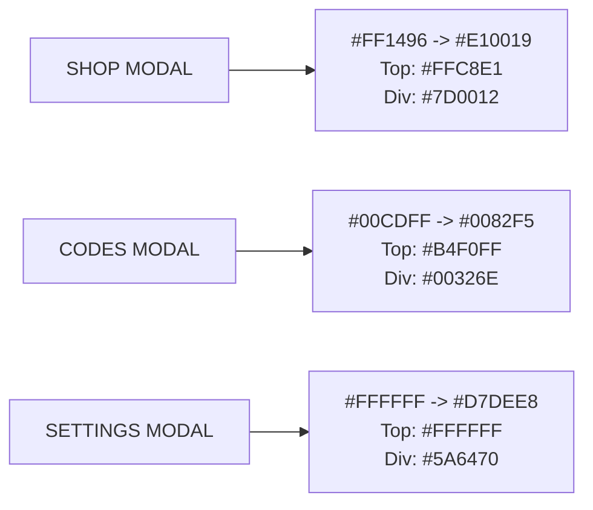

# Check-UI — Complete Roblox Cartoon & Simulator UI Design System

> **The definitive design specification for high-engagement, non-generic Roblox game interfaces.**  
> Crafted with mathematical precision, strict typography hierarchies, 3D tactile bevels, and universal multi-device responsive scaling.

---

## Table of Contents
1. [Design Philosophy & Core Rules](#1-design-philosophy--core-rules)
2. [Foundations: Geometry & Strokes](#2-foundations-geometry--strokes)
3. [Color Palette & Thematic Matrix](#3-color-palette--thematic-matrix)
4. [Typography & Text Styling Rules](#4-typography--text-styling-rules)
5. [Textures & Visual Effects](#5-textures--visual-effects)
6. [Component Library & Blueprints](#6-component-library--blueprints)
   - [6.1 The 3D Beveled Square Close Button `[X]`](#61-the-3d-beveled-square-close-button-x)
   - [6.2 3D Beveled Action & Buy Buttons](#62-3d-beveled-action--buy-buttons)
   - [6.3 2-Tier Header Divider with Shadow Bar](#63-2-tier-header-divider-with-shadow-bar)
   - [6.4 Recessed Dark Content Cards & Containers](#64-recessed-dark-content-cards--containers)
   - [6.5 Interactive Toggle Switches](#65-interactive-toggle-switches)
   - [6.6 Text Inputs & Code Redeem Fields](#66-text-inputs--code-redeem-fields)
7. [Universal Responsive Engine (`UIScale`)](#7-universal-responsive-engine-uiscale)
8. [Animation & Sound Micro-Interactions](#8-animation--sound-micro-interactions)

---

## 1. Design Philosophy & Core Rules

Modern top-grossing Roblox games (*Pet Simulator 99*, *Blade Ball*, *Anime Champions*, *Arm Wrestle Simulator*) share a distinct aesthetic:
- **Clean Comic / Cartoon Styling**: High-contrast dark borders, subtle rounded corners, and pastel highlight strokes.
- **Physical Depth**: Every button feels clickable in the physical world thanks to a 3px to 4px 3D extrusion bottom bevel.
- **Vibrant & Grounded**: Pure saturated gradients resting atop an opaque, deep slate blue canvas (`#3B5866`).
- **Zero Distortions**: Icons never stretch (`ScaleType = Fit`), and textures never end in harsh cutoffs.

### The 7 Non-Negotiable Check-UI Commandments

```
[1] Strict GothamBlack   --> No other fonts allowed for titles, buttons, or counters.
[2] 100% Opaque Slate    --> BackgroundColor3 = #3B5866, BackgroundTransparency = 0.
[3] 3D Beveled Close [X] --> 38x38 square with #730010 base and shifted face.
[4] 2-Tier Header Shadow --> Dark theme accent line (3px) + pure black line (3px).
[5] Seamless Damier Fade --> Full height checkerboard with vertical gradient transparency.
[6] Centered Animations  --> AnchorPoint = (0.5, 0.5) with UIScale micro-interactions.
[7] Responsive UIScale   --> Clamped [0.52, 1.18] from ViewportSize (baseline 1050x620).
```

---

## 2. Foundations: Geometry & Strokes

### 2.1 Corner Radii (`UICorner`)
- **Modal Windows**: `4 px` (`UDim.new(0, 4)`)
- **Header Panels**: `4 px` (clipped by window `ClipsDescendants = true`)
- **Content Cards / Rows**: `4 px`
- **Buttons / Toggles**: `4 px`
- **Inner Highlight Frames**: `0 px` to `3 px` (matching parent border curve)

### 2.2 Stroke Hierarchies (`UIStroke`)
In Check-UI, strokes establish visual hierarchy and separate layers:

| Target Object | Thickness | Color | ApplyStrokeMode | Notes |
| :--- | :--- | :--- | :--- | :--- |
| **Window Frame** | `3.5 px` | `#181E22` (Deep Charcoal) | `Border` | Primary silhouette boundary |
| **Close Button Outer** | `2.8 px` | `#000000` (Pure Black) | `Border` | Heavy comic button border |
| **Close Button Highlight** | `1.2 px` | `#FFD2EB` (Pastel Pink) | `Border` | Top/inner highlight line |
| **Action / Buy Button** | `2.8 px` | `#000000` (Pure Black) | `Border` | Solid clickable punch |
| **Button Inner Highlight** | `1.2 px` | `#EBFF82` / `#FFB0D0` | `Border` | Pastel top-edge reflection |
| **Content Card Outer** | `2.8 px` | `#000000` (Pure Black) | `Border` | Card boundary |
| **Content Card Highlight** | `1.2 px` | `#4B7D91` (Pastel Slate) | `Border` | Translucent (0.4) inner glow |
| **Window Header Title** | `3.2 px` | `#000000` (Pure Black) | `Contextual` | Text outline for 38px font |
| **Button Text Labels** | `2.8 px` | `#000000` (Pure Black) | `Contextual` | Text outline for 24-26px font |
| **Body / Subtitle Text** | `2.0 px` | `#000000` (Pure Black) | `Contextual` | Text outline for 14-18px font |

---

## 3. Color Palette & Thematic Matrix

```
Canvas Base:        #3B5866  (RGB: 59, 88, 102)  -- Solid Slate Blue
Outer Border:       #181E22  (RGB: 24, 30, 34)   -- Deep Charcoal
Card Fill:          #1A2C34  (RGB: 26, 44, 52)   -- Recessed Slate
Divider Shadow:     #000000  (RGB: 0, 0, 0)      -- Solid Black (3px)
```

### Thematic Header Palettes



---

## 4. Typography & Text Styling Rules

### 4.1 Strict Font Choice
Only **`Enum.Font.GothamBlack`** is permitted across all user-facing interfaces.
Never use `SourceSans`, `FredokaOne`, or `GothamBold` as substitutes: `GothamBlack` provides the iconic heavy punch required for cartoon game aesthetics.

### 4.2 Text Hierarchy Matrix

| Element | Font Size | Text Color | Stroke Thickness | Stroke Color | TextXAlignment |
| :--- | :--- | :--- | :--- | :--- | :--- |
| **Header Title** | `38 px` | `#FFFFFF` | `3.2 px` | `#000000` | Left (`Position = (0, 18, 0.5, -2)`) |
| **Section Header** | `24 px` | `#FFFFFF` | `2.6 px` | `#000000` | Center (`~Gamepass~`, `~Products~`) |
| **Card Title** | `24 px` | `#FFFFFF` | `2.8 px` | `#000000` | Left / Center |
| **Button Label** | `24 - 26 px` | `#FFFFFF` | `2.8 px` | `#000000` | Center |
| **Close Button 'X'** | `29 px` | `#FFFFFF` | `3.0 px` | `#000000` | Center |
| **Code Input Text** | `21 - 22 px` | `#FFFFFF` | `2.4 px` | `#000000` | Left (`Offset = 12px`) |
| **Placeholder Text**| `21 - 22 px` | `#91AFBE` | `2.4 px` | `#000000` | Left |
| **Subtitles / Info**| `14 - 18 px` | `#C3D7E4` | `2.0 px` | `#000000` | Center / Left |

---

## 5. Textures & Visual Effects

### 5.1 Checkerboard (Damier) Pattern
- **Asset ID**: `rbxassetid://385956923`
- **ScaleType**: `Enum.ScaleType.Tile`
- **TileSize**:
  - Headers: `UDim2.new(0, 26, 0, 26)`
  - Cards: `UDim2.new(0, 22, 0, 22)`
  - Buttons: `UDim2.new(0, 16, 0, 16)` to `UDim2.new(0, 18, 0, 18)`
- **The "No Cutoff" Gradient Rule**:
  Never set a partial button height (e.g. `Size = (1, 0, 0.65, 0)`). This produces an ugly horizontal cut.
  Always set `Size = UDim2.new(1, 0, 1, 0)` and apply a vertical `UIGradient` with the 4-point transparency sequence:
  ```lua
  NumberSequence.new{
      NumberSequenceKeypoint.new(0, 1.00),   -- Fully transparent at top edge
      NumberSequenceKeypoint.new(0.30, 0.82), -- Gentle onset
      NumberSequenceKeypoint.new(0.70, 0.35), -- Visible checkerboard
      NumberSequenceKeypoint.new(1.00, 0.10)  -- Solid textured bottom
  }
  ```

### 5.2 Faded Sunburst with Bloom
- **Asset ID**: `rbxassetid://130563114903838`
- **Placement**: Centered directly behind item/icon displays.
- **Rotation Speed**: `20 degrees / second` via `RunService.RenderStepped` when the menu is visible. Paused automatically when closed.

---

## 6. Component Library & Blueprints

### 6.1 The 3D Beveled Square Close Button `[X]`

```
+------------------------------------+  <-- CloseButton (38x38, Base: #730010, Stroke: 2.8px)
| +--------------------------------+ |
| |                                | |  <-- Face (UDim2.new(1, 0, 1, -4), Shifted Up)
| |   +------------------------+   | |      Gradient: #FF7DAF -> #FF1428
| |   |                        |   | |  <-- InnerBorder (1.2px stroke, #FFD2EB)
| |   |           X            |   | |  <-- TextLabel "X" (29px GothamBlack, 3px stroke)
| |   |                        |   | |
| |   +------------------------+   | |
| +--------------------------------+ |
| ================================== |  <-- SepLine (1px #46000A)
| ////////////////////////////////// |  <-- 3D Bottom Bevel (4px height extrusion)
+------------------------------------+
```

### 6.2 3D Beveled Action & Buy Buttons

Every button contains:
1. `UICorner` (4px).
2. `UIStroke` (2.8px black outer border).
3. `UIGradient` (vibrant top color to deeper bottom color).
4. `Frame` at `(0, 0, 1, -3)` with `Size = (1, 0, 0, 3)` (dark 3D extrusion bevel).
5. `InnerHighlight` with 1.2px pastel stroke.
6. Seamless `Damier` overlay.
7. `ButtonScale` (`UIScale`) for center micro-interactions.

---

## 7. Universal Responsive Engine (`UIScale`)

```lua
local camera = workspace.CurrentCamera

local function getDeviceScale()
    local viewport = camera.ViewportSize
    if viewport.X <= 0 or viewport.Y <= 0 then return 1 end
    
    -- Design baseline: 1050 x 620
    local scaleX = viewport.X / 1050
    local scaleY = viewport.Y / 620
    local factor = math.min(scaleX, scaleY)
    
    -- Clamp: Phone screens (0.52) to 4K monitors (1.18)
    return math.clamp(factor, 0.52, 1.18)
end
```

---

## 8. Animation & Sound Micro-Interactions

### Hover & Click Tweens
- **Hover In**: Scale to `1.05` in `0.08s` (`Quad.Out`), play `HoverSound`.
- **Hover Out**: Scale to `1.00` in `0.08s` (`Quad.Out`).
- **Mouse Down**: Scale to `0.94` in `0.05s` (`Quad.Out`), play `ClickSound`.
- **Mouse Up**: Scale to `1.05` in `0.12s` (`Back.Out`).

### Pop Modal Open / Close
- **Open**: Scale starts at `targetScale * 0.72` with `Y + 16px` offset, tweens to `targetScale` in `0.24s` with `EasingStyle.Back.Out`.
- **Close**: Tweens to `currentScale * 0.70` with `Y + 14px` offset in `0.14s` with `EasingStyle.Back.In`, then sets `Visible = false`.

---

## 9. Center-Anchored Interaction Architecture

ALL interactive elements (buttons, cards, icons, toggles) MUST use center-anchored scaling:

### 9.1 Mandatory Properties

Every interactive GUI element must set:
```lua
element.AnchorPoint = Vector2.new(0.5, 0.5)  -- Scale from exact geometric center
element.Position = UDim2.new(...)              -- Position references the center point
```

Then attach a child `UIScale`:
```lua
local uiScale = Instance.new("UIScale")
uiScale.Name = "ButtonScale"  -- or CardScale, IconScale, etc.
uiScale.Scale = 1
uiScale.Parent = element
```

### 9.2 Why Not Top-Left Anchored?

Roblox `UIScale` scales from the `AnchorPoint`. Default `(0, 0)` causes asymmetric downward-right growth on hover — a hallmark of amateur UI. Center-anchored `(0.5, 0.5)` produces uniform expansion in all four directions, the standard "pop" effect used in Pet Simulator 99, Blade Ball, and all professional Roblox titles.

### 9.3 Animation Origin Rule

All hover/click/interaction tweens animate the `UIScale.Scale` property from center:
- Hover In: Scale → `1.05` in `0.08s` (Quad.Out)
- Hover Out: Scale → `1.00` in `0.08s` (Quad.Out)
- Mouse Down: Scale → `0.94` in `0.05s` (Quad.Out)
- Mouse Up: Scale → `1.05` in `0.12s` (Back.Out)

Never animate `Position` or `Size` for scale effects. Always animate `UIScale.Scale`.

---

## 10. CheckUIIcons Registry (1,022 HD Icons)

Check-UI ships with a production-ready Luau module containing **1,022 pre-uploaded HD icons (256px)** organized across 10 categories and 130 subcategories.

### Categories
| Category | Icons | Subcategories |
|:---|:---|:---|
| Animal | 12 | Bunny, Cat, Dog |
| Currency | 110 | Cash, Coin, Crystal, Diamond, Ingot, Premium, Robux, Ticket |
| Exclusive | 32 | Angel Heart, Aura, Aura 2, Magical Teleport, Toilet with Head, Trail, Tung, VIP |
| Food | 48 | Avocado, Bait, Blueberry, Burger, Carrot, Cookie, Lemon, Pancake, Pizza |
| Item | 326 | 38 subcategories (Axe, Sword, Crown, Shield, Key, Trophy, etc.) |
| Main | 236 | 27 subcategories (Settings, Codes, Music ON/OFF, Sound ON/OFF, Shopping Cart, etc.) |
| Nature | 86 | Apple, Banana, Cloud, Clover, Leaf, Orange, Planet, Strawberry, etc. |
| Player | 74 | Player, Friend, Add Player, Full Body, RIP, Skull, etc. |
| Social | 24 | Discord, Guilded, Twitter, X |
| UI | 74 | Chat, Checkmark, Close Button, Cursor, Plus, Minus, Warning, X, etc. |

### Usage
```lua
local Icons = require(game.ReplicatedStorage.CheckUI.CheckUIIcons)

-- Direct access
local coinIcon = Icons.Currency.Coin.Golden_Coin_1st

-- Path lookup
local icon = Icons.Get("Item/Sword/Sword 1st")

-- Fuzzy search
local results = Icons.Search("crown")
```

All icons follow the naming convention: `{Variant}_{Name}_{Edition}` with optional `_Outline` suffix. Most icons have 4 variants: Standard, Standard Outline, Golden, Golden Outline.
