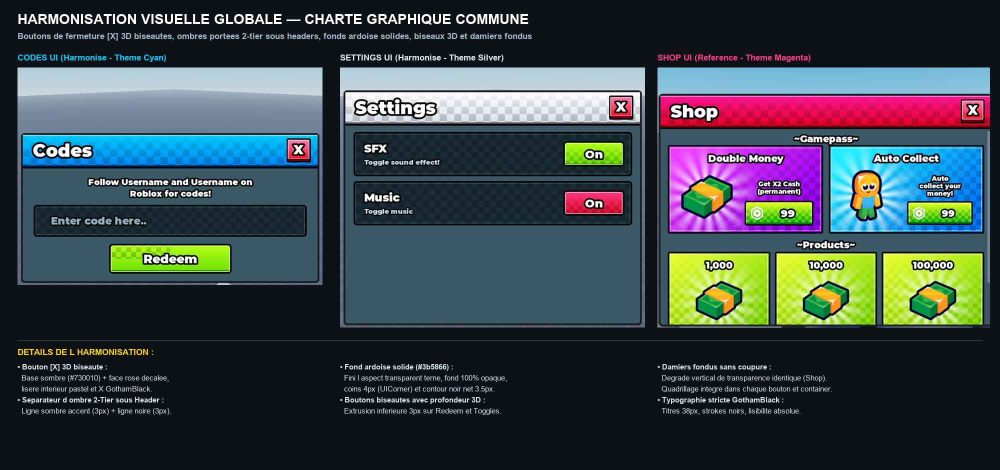

# Check-UI CLEAN ROBLOX SKILL

[](https://roblox.com)
[]()
[]()
[]()
[]()

> **The definitive design system, component framework, and agentic AI skill for creating modern cartoon and simulator game interfaces in Roblox Studio.**

---

## 🎨 Visual Showcase (Harmonized Menus)



*All three menus (Codes, Settings, Shop) share the exact same mathematical proportions, solid slate canvas (`#3B5866`), 3D beveled square Close Button `[X]`, 2-tier header shadow separator, seamless fading damier patterns, and strict GothamBlack typography.*

---

## 🌟 Why Check-UI?

Too many Roblox UIs suffer from **"AI Slop"** — washed-out semi-transparent rectangles, stretched icons, harsh texture cutoffs, generic non-tactile flat buttons, and zero responsiveness on mobile devices.

**Check-UI solves this forever** by standardizing:
1. **Physical 3D Depth**: Every button features a 3px to 4px bottom extrusion bevel with dark shadow borders.
2. **Signature 3D Close Button `[X]`**: Exact 38x38px square with dark burgundy base (`#730010`), shifted crimson face, pastel highlight stroke, and centered micro-interaction.
3. **2-Tier 3D Header Shadow**: Separates the vibrant colored header from the canvas using an upper 3px dark thematic accent line and a lower 3px pure black line.
4. **Seamless Damier (Checkerboard) Fade**: No more horizontal cutoff lines! Full-height texture overlay with a smooth 4-point vertical transparency gradient.
5. **Universal Multi-Device Scaling Engine**: Adapts dynamically across phone screens (0.52x), tablets, and high-DPI desktop screens (1.18x) based on `camera.ViewportSize`.
6. **Continuous Rotating Sunbursts**: Smooth 20°/sec rotation behind items, automatically pausing when menus are hidden.
7. **Zero Stretched Icons**: Strict `Enum.ScaleType.Fit` enforcement.

---

## 📦 What's Included

```
Check-UI-Clean-Roblox/
├── SKILL.md                 # Agentic AI Skill (usable by Antigravity, Claude, ChatGPT, Cursor)
├── DESIGN_SYSTEM.md         # Exhaustive design manual & mathematical specifications
├── README.md                # Project documentation & visual showcase
├── assets/                  # High-resolution showcase panoramas and comparison renders
│   ├── all_menus_harmonized.png
│   └── shop_compact_comparison.png
├── src/                     # Production-ready Luau modules
│   ├── CheckUITheme.luau       # Design tokens, color palettes, and asset IDs
│   ├── CheckUIComponents.luau  # Builders for Windows, Headers, 3D Buttons, Close Buttons
│   ├── CheckUIController.luau  # Client controller: scaling, pop tweens, micro-interactions
│   └── CheckUIIcons.luau       # 1,022 HD icon registry (256px) with real rbxassetids
└── examples/                # Complete, standalone menu scripts
    ├── ShopMenuExample.luau    # Compact 600x415 Shop with Gamepasses & Products
    ├── SettingsMenuExample.luau# 528x415 Settings with 3D SFX & Music toggles
    └── CodesMenuExample.luau   # 528x262 Codes with input box & 3D Redeem button
```

---

## 🚀 Quick Start

### 1. Using as an AI Skill (Antigravity / Coding Agents)
Copy `SKILL.md` into your agent's skills directory:
```
~/.gemini/antigravity/builtin/skills/check-ui-clean-roblox/SKILL.md
# or inside your workspace:
.agents/skills/check-ui-clean-roblox/SKILL.md
```
Whenever you ask your AI: *"Create a Shop menu for my simulator"*, the agent will automatically adhere to the Check-UI design system.

### 2. Manual Roblox Studio Usage
1. Place `src/CheckUITheme.luau` and `src/CheckUIComponents.luau` inside `ReplicatedStorage.CheckUI`.
2. In a `LocalScript` inside `StarterGui`, build your windows:

```lua
local ReplicatedStorage = game:GetService("ReplicatedStorage")
local CheckUI = require(ReplicatedStorage.CheckUI.CheckUIComponents)
local Theme = require(ReplicatedStorage.CheckUI.CheckUITheme)

local screenGui = script.Parent

-- Create a Modal Window
local shopWindow = CheckUI.createWindow({
    Name = "ShopFrame",
    Size = UDim2.new(0, 600, 0, 415),
    Parent = screenGui
})

-- Create Header with 2-Tier 3D Divider Bar and [X] Close Button
local header = CheckUI.createHeader(shopWindow, "Shop", Theme.HeaderThemes.Shop)

-- Create a 3D Beveled Buy Button
local buyBtn = CheckUI.create3DButton({
    Name = "BuyButton",
    Size = UDim2.new(0, 120, 0, 38),
    Position = UDim2.new(0.5, 0, 0.8, 0),
    Text = "99 R$",
    Parent = shopWindow
})
```

---

## 🎨 Icon Registry (1,022 HD Icons)

Check-UI includes a **complete icon registry** with 1,022 production-ready 256px HD icons across 10 categories:

| Category | Icons | Subcategories |
|:---|:---|:---|
| 🐾 Animal | 12 | Bunny, Cat, Dog |
| 💰 Currency | 110 | Cash, Coin, Crystal, Diamond, Ingot, Premium, Robux, Ticket |
| ⭐ Exclusive | 32 | Angel Heart, Aura, Trail, VIP, + 4 more |
| 🍔 Food | 48 | Avocado, Burger, Cookie, Pizza, + 5 more |
| 🛠️ Item | 326 | Sword, Crown, Shield, Key, Trophy, + 33 more |
| 🏠 Main | 236 | Settings, Codes, Music, Sound, Star, + 22 more |
| 🌿 Nature | 86 | Apple, Cloud, Clover, Planet, + 7 more |
| 👤 Player | 74 | Player, Friend, Skull, + 6 more |
| 💬 Social | 24 | Discord, Twitter, X, Guilded |
| 🖱️ UI | 74 | Checkmark, Close, Plus, Warning, + 9 more |

```lua
local Icons = require(game.ReplicatedStorage.CheckUI.CheckUIIcons)
local coin = Icons.Currency.Coin.Golden_Coin_1st  -- "rbxassetid://..."
local results = Icons.Search("sword")  -- fuzzy search
```

---

## 📐 Color Palette Reference

| Token | Hex | RGB | Usage |
| :--- | :--- | :--- | :--- |
| **Canvas Base** | `#3B5866` | `59, 88, 102` | Solid slate blue modal canvas |
| **Canvas Stroke** | `#181E22` | `24, 30, 34` | 3.5px outer window outline |
| **Card Recessed** | `#1A2C34` | `26, 44, 52` | Recessed dark container background |
| **Card Highlight** | `#4B7D91` | `75, 125, 145` | 1.2px inner stroke (0.4 transparency) |
| **Close Base (3D)**| `#730010` | `115, 0, 16` | Burgundy 3D bevel extrusion for `[X]` |
| **Green Bevel** | `#0F780F` | `15, 120, 15` | 3px bottom 3D bevel on Buy / Redeem |
| **Pink Bevel** | `#780A2D` | `120, 10, 45` | 3px bottom 3D bevel on Music On |

---

## 📄 License

Distributed under the **MIT License**. Free to use, adapt, and distribute in any personal or commercial Roblox experience.
